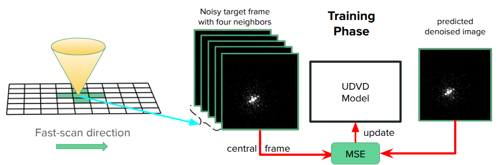

<p align="left">
  <a href="https://opensource.org/licenses/MIT">
    
  </a>
  
  
  
  <a href="https://github.com/ashriva16/4Denoising/issues">
    
  </a>
  <a href="https://github.com/ashriva16/4Denoising/pulls">
    
  </a>
</p>

# Unsupervised Deep Denoising for High-Dimensional Microscopy Data

**Authors:**
Leonardo Cancellara¹ · William Talbott² · **Ankit Shrivastava³** · Jordi Weingard² · Dingqiao Ji¹ · Ian MacLaren⁴

¹ Max Planck Institute of Colloids and Interfaces
² University of Manchester
³ Oak Ridge National Laboratory
⁴ School of Physics and Astronomy, University of Glasgow, UK

## 📌 Description

This repository implements an unsupervised deep-learning framework for denoising high-dimensional microscopy data, with a primary focus on 4D-STEM.
The approach is based on UDVD (Unsupervised Deep Video Denoising), a UNet-based convolutional neural network that exploits structural similarity between neighboring frames without requiring any ground-truth clean data.

Originally developed for time-series video denoising, UDVD is generalized here to multidimensional microscopy datasets by replacing temporal adjacency with geometric-flow connectivity in real space. This enables pixel-wise denoising of diffraction patterns using spatially adjacent scan positions.



## Youtube link
[](https://www.youtube.com/watch?v=NVjtHF1Ujv0)

---

## 📁 Repository Setup

```sh
git clone https://github.com/ashriva16/4Denoising.git
cd 4Denoising
```

---

## 🚀 End-User Setup & Usage

- **Use the Makefile to create a .venv and install user-level dependencies.**

    ```bash
    make env
    ```

    This creates `.venv/` and installs packages from `requirements.txt` (if present).

- **For refreshing and installing updated dependencies, run**

    ```bash
    git pull        # get latest code + updated requirements.txt
    make install    # refresh dependencies inside .venv
    ```

- **Usage**

    ```sh
    source .venv/bin/activate
    python -m scripts.train # to train model from scratch
    python -m scripts.eval # to evaluate trained model
    python -m scripts.run_pretrain # to run pretrained UDVD model, see references
    python -m scripts.finetune # to finetune pretrained trained model
    ```

---

## 👤 Maintainer

**Ankit Shrivastava**
Feel free to contact me for issues.

---

## 📜 License

This project is licensed under the [MIT License](https://opensource.org/licenses/MIT). See the `LICENSE` file for full details.

---

## 📘 References

- [Cookiecutter Docs](https://cookiecutter.readthedocs.io)
- [PEP 621](https://peps.python.org/pep-0621/)
- [GitHub Actions](https://docs.github.com/en/actions)
- https://github.com/crozier-del/UDVD-MF-Denoising/tree/v1.0?tab=readme-ov-file
- https://github.com/sreyas-mohan/udvd
